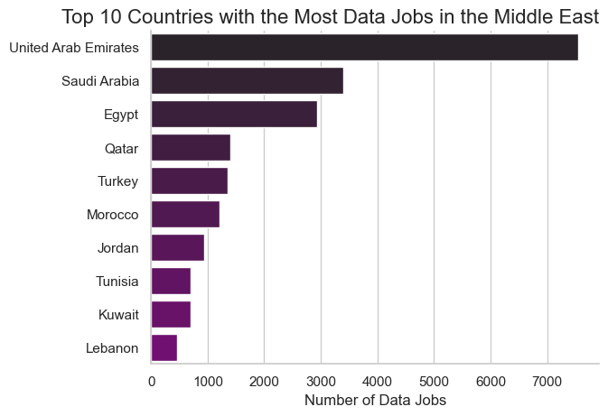
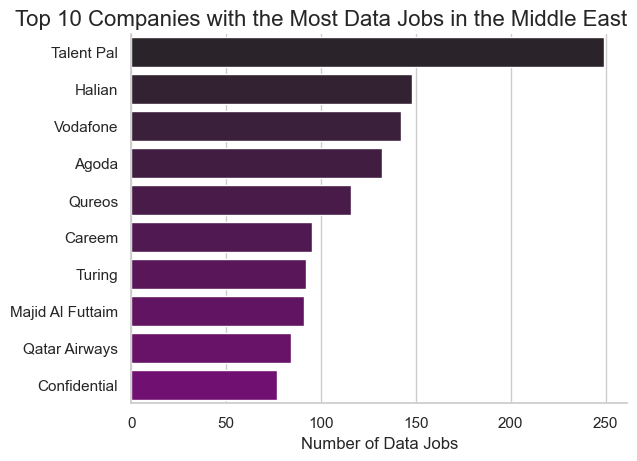
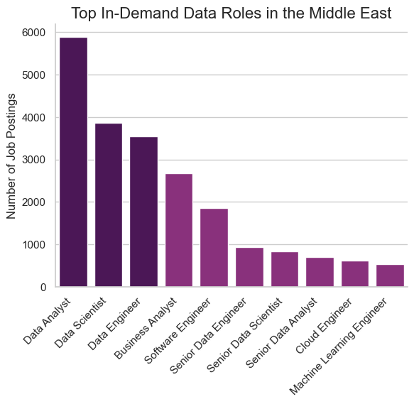
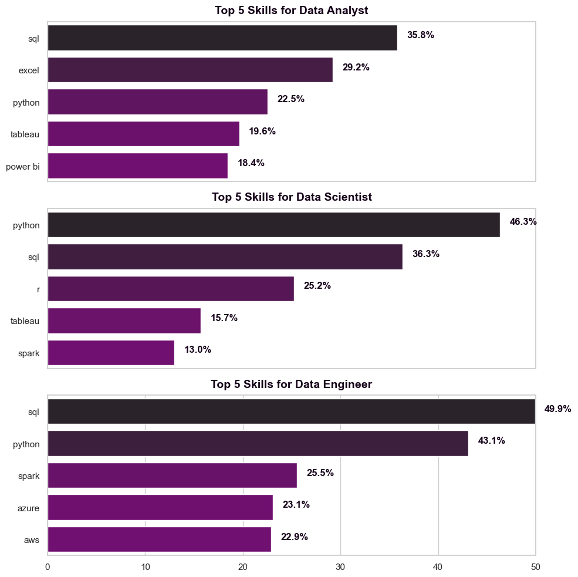
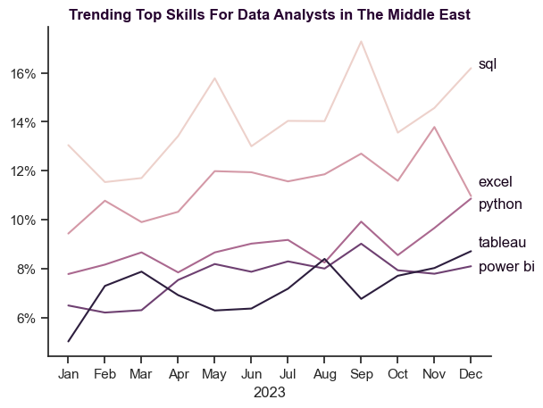
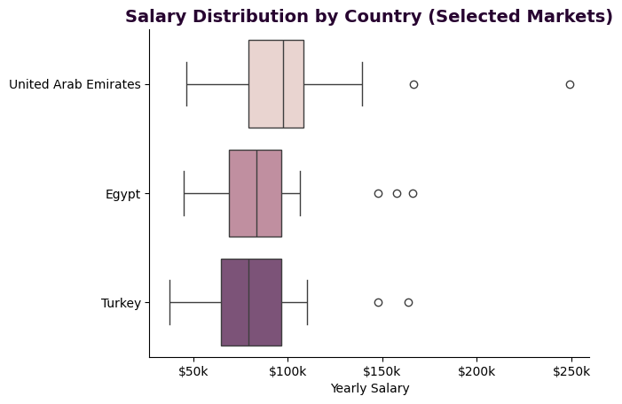
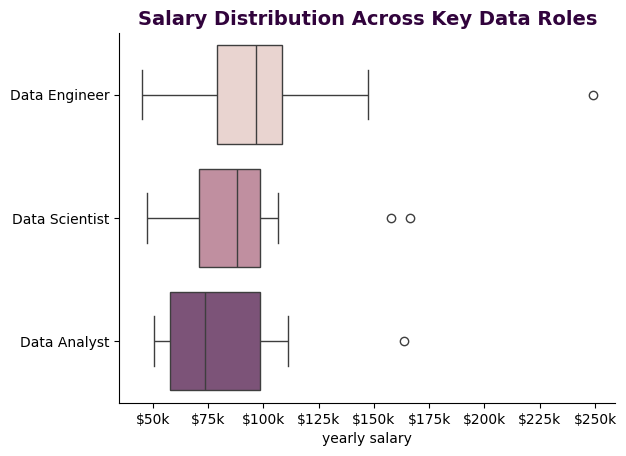
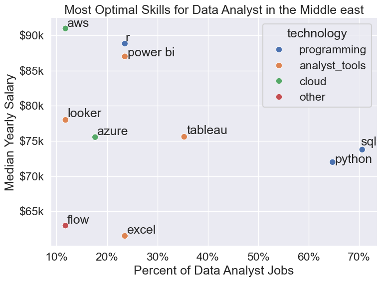

# Data Jobs Analysis in the Middle East

A data analysis project exploring the data job market across the Middle East region, including job demand, required skills, salary distributions, and optimal skills for Data Analysts. The analysis is based on real job postings from 2023.

---

## Dataset

The dataset is loaded directly from Hugging Face using the `datasets` library to ensure reproducibility and avoid large file uploads.

```python
from datasets import load_dataset
ds = load_dataset("lukebarousse/data_jobs")
df = ds['train'].to_pandas()
```

**Source:** [`lukebarousse/data_jobs`](https://huggingface.co/datasets/lukebarousse/data_jobs)  
**Scope:** Job postings filtered to Middle East countries (17 countries including UAE, Saudi Arabia, Egypt, Turkey, and more)

---
# The Analysis

## 1. How is the data job market distributed across countries, companies, and roles in the Middle East?

### Visualize Data

```python
middle_east = ['Algeria', 'Bahrain', 'Egypt', 'Iraq', 'Jordan', 'Kuwait', 'Lebanon',
               'Libya', 'Morocco', 'Oman', 'Palestine', 'Qatar', 'Saudi Arabia',
               'Tunisia', 'Turkey', 'United Arab Emirates', 'Yemen']

df_me = df[df['job_country'].isin(middle_east)]

# --- Top Countries ---
df_top_countries = df_me['job_country'].value_counts().head(10).to_frame()

sns.set_theme(style="whitegrid")
sns.barplot(data=df_top_countries, x='count', y='job_country',
            hue='job_country', palette="dark:purple", legend=False)
sns.despine()
plt.title('Top 10 Countries with the Most Data Jobs in the Middle East', fontsize=16, loc='right')
plt.xlabel('Number of Data Jobs')
plt.ylabel('')
plt.show()

# --- Top Companies ---
df_top_companies = df_me['company_name'].value_counts().head(10).to_frame()

sns.set_theme(style="whitegrid")
sns.barplot(data=df_top_companies, x='count', y='company_name',
            hue='company_name', palette="dark:purple", legend=False)
sns.despine()
plt.title('Top 10 Companies with the Most Data Jobs in the Middle East', fontsize=16, loc='right')
plt.xlabel('Number of Data Jobs')
plt.ylabel('')
plt.show()

# --- Top Roles ---
df_top_data_jobs = df_me['job_title_short'].value_counts()
df_top_data_jobs = df_top_data_jobs.reset_index(name='job count')

n = len(df_top_data_jobs)
colors = ['#520c61'] * 3 + ['#982286'] * (n - 3)

sns.barplot(data=df_top_data_jobs, x='job_title_short', y='job count', palette=colors)
plt.xticks(rotation=45, ha='right')
plt.title('Top In-Demand Data Roles in the Middle East', fontsize=16, loc='center')
plt.xlabel('')
plt.ylabel('Number of Job Postings')
sns.despine()
plt.show()
```

### Results

**Top 10 Countries with the Most Data Jobs**




**Top 10 Companies with the Most Data Jobs**



**Top In-Demand Data Roles**



### Insights

- The **United Arab Emirates** leads the region by a wide margin, with over 7,000 data job postings — nearly double the next closest country. This suggests the UAE is the dominant market for data professionals in the region.
- **Saudi Arabia** and **Egypt** follow as the second and third largest markets, though their posting volumes are noticeably lower, indicating meaningful but more limited demand.
- On the company level, **Talent Pal** appears to be the most active employer for data roles, standing well above other companies. This may reflect the nature of the platform as a job aggregator rather than a single employer.
- Across roles, **Data Analyst**, **Data Scientist**, and **Data Engineer** tend to be the most in-demand positions, collectively accounting for the majority of job postings in the region.

---


## 2.What are the most in-demand skills for the top 3 data roles?

### Visualize Data

```python
fig, ax = plt.subplots(len(job_titles), 1, figsize=(10, 10))

for i, job in enumerate(job_titles):
    df_top5_skills = df_skills_percent[df_skills_percent['job_title_short'] == job].head(5)
    sns.barplot(data=df_top5_skills, x='skill percent', y='job_skills',
                hue='skill percent', ax=ax[i], legend=False, palette='dark:purple_r')
    ax[i].set_ylabel('')
    ax[i].set_xlabel('')
    ax[i].set_title(f'Top 5 Skills for {job}', fontsize=14, loc='center',
                    color="#16031a", fontweight='bold', pad=10)
    ax[i].set_xlim(0, 50)
    for n, v in enumerate(df_top5_skills['skill percent']):
        ax[i].text(v + 1, n, f"{v:.1f}%", color="#16031a", fontweight='bold')
    if i != len(job_titles) - 1:
        ax[i].set_xticks([])

fig.tight_layout()
plt.show()
```

### Results



### Insights

- **SQL** and **Python** appear consistently across all three roles, making them the most universally valued foundational skills in the data field.
- For **Data Analysts**, SQL leads at ~36%, followed by Excel (~29%), suggesting that many analyst roles still rely heavily on spreadsheet tools alongside querying.
- **Data Scientists** show the strongest demand for Python (~46%), reflecting the role's emphasis on statistical modeling and machine learning workflows.
- **Data Engineers** exhibit the highest combined demand for SQL (~50%) and Python (~43%), along with cloud and big data tools such as Spark, Azure, and AWS — indicating a more infrastructure-oriented skill set.
- Excel is notably absent from the top skills for Data Scientists and Data Engineers, suggesting it is primarily associated with analyst-level work.

---

## 3.Which skills were most trending among Data Analysts in 2023?

### Visualize Data

```python

sns.lineplot(data=df_trend_skills_percent, dashes=False, legend=False,
             palette=sns.cubehelix_palette(n_colors=5))
plt.title('Trending Top Skills For Data Analysts in The Middle East', color="#270330", fontweight='bold')
plt.xlabel('2023')
sns.despine()

offsets = [0, 0.4, -0.4, 0.8, -0.8]
for i in range(5):
    plt.text(11.2, df_trend_skills_percent.iloc[-1, i] + offsets[i],
             df_trend_skills_percent.columns[i], color="#16031a")

from matplotlib.ticker import PercentFormatter
ax = plt.gca()
ax.yaxis.set_major_formatter(PercentFormatter(decimals=0))
plt.show()
```

### Results



### Insights

- **SQL** remains the most consistently demanded skill throughout 2023, maintaining the highest mention rate across all months. This reinforces its status as a core, non-negotiable skill for Data Analysts in the region.
- **Excel** and **Python** track closely together at mid-range demand levels, suggesting that employers tend to expect proficiency in both alongside SQL.
- **Tableau** and **Power BI** show relatively stable but lower demand, indicating that visualization tools are valued but may be treated as secondary to programming and querying skills.
- There is a slight uptick in SQL demand toward the end of the year, which may reflect increased hiring activity in Q4 — though the dataset does not allow for a definitive conclusion.
- Overall, the top 5 skills appear relatively stable month-over-month, suggesting that skill requirements for Data Analyst roles in the Middle East are consistent rather than rapidly evolving.

---


## 4.How do salaries vary across Egypt, Turkey, and the United Arab Emirates?

### Visualize Data

```python

plt.Figure(figsize=(8, 5))
sns.boxplot(df_top3_countries, x='salary_year_avg', y='job_country',
            order=order.index, palette=sns.cubehelix_palette(n_colors=4))
plt.title('Salary Distribution by Country (Selected Markets)', fontsize=14, weight='bold', color="#270330")
plt.xlabel('Yearly Salary')
plt.ylabel('')

ax = plt.gca()
ax.xaxis.set_major_formatter(plt.FuncFormatter(lambda x, _: f'${int(x/1000)}k'))
sns.despine()
plt.show()
```

### Results



### Insights

> **Note:** The salary data is limited (87 out of ~2,148 Middle East entries contain salary information). These insights should be interpreted as indicative rather than conclusive.

- The **United Arab Emirates** tends to offer higher salary ranges compared to Egypt and Turkey, with a wider spread and higher outliers, suggesting stronger earning potential in the UAE market.
- **Egypt** and **Turkey** show broadly similar salary distributions, with median salaries appearing lower than those in the UAE.
- All three countries exhibit high-value outliers, indicating that while most roles fall within a moderate range, top-tier positions or specialized roles can command significantly higher compensation.
- The relatively balanced representation of these three countries in the salary dataset makes them a reasonable basis for regional comparison.

---

## 5.How do salaries differ across Data Analyst, Data Scientist, and Data Engineer roles?

### Visualize Data

```python

sns.boxplot(data=df_roles_salary, x='salary_year_avg', y='job_title_short',
            order=order_salary.index, palette=sns.cubehelix_palette(n_colors=4))
plt.title('Salary Distribution Across Key Data Roles', fontsize=14, weight='bold', color="#31033C")
plt.ylabel('')
plt.xlabel('yearly salary')

ax = plt.gca()
ax.xaxis.set_major_formatter(plt.FuncFormatter(lambda x, _: f'${int(x/1000)}k'))
sns.despine()
plt.show()
```

### Results



### Insights

> **Note:** Due to the limited salary records per role, the following analysis provides indicative comparisons rather than definitive conclusions.

- **Data Engineers** tend to have the widest salary range and appear to command higher median salaries compared to the other roles, which may reflect the technical depth required for the position.
- **Data Scientists** show competitive salaries, with a distribution broadly comparable to Data Engineers in some ranges.
- **Data Analysts** generally appear to have lower median salaries, consistent with the role typically being considered more entry-to-mid level than Data Scientist or Data Engineer positions.
- High-value outliers are present across all three roles, suggesting that seniority, company type, or specific skill sets can lead to significantly above-average compensation.

---

## 6.What are the most valuable skills for Data Analysts?

### Visualize Data

```python

df_plot = df_DA_high_demand_skills.merge(df_tech, left_on='job_skills', right_on='skills')

from adjustText import adjust_text

fig, ax = plt.subplots(figsize=(8, 6))
sns.set_theme()
sns.set_context("talk")
sns.scatterplot(data=df_plot, x='skill precent', y='median salary', hue='technology')

texts = []
for i, text in enumerate(df_DA_high_demand_skills.index):
    texts.append(ax.text(df_DA_high_demand_skills['skill precent'].iloc[i],
                         df_DA_high_demand_skills['median salary'].iloc[i], text))

plt.xlabel('Percent of Data Analyst Jobs')
plt.ylabel('Median Yearly Salary')
plt.title('Most Optimal Skills for Data Analyst in the Middle east')

from matplotlib.ticker import PercentFormatter
ax.xaxis.set_major_formatter(PercentFormatter(decimals=0))
ax.yaxis.set_major_formatter(plt.FuncFormatter(lambda y, pos: f'${int(y/1000)}k'))
adjust_text(texts, ax=ax)

plt.tight_layout()
sns.despine()
plt.show()
```

### Results



### Insights

> **Note:** Due to the limited number of salary records, the following insights should be interpreted as indicative rather than definitive.

- **SQL** and **Python** stand out as the most optimal skills overall — they appear in the largest share of job postings and are associated with competitive median salaries, making them the highest-priority skills for Data Analysts to develop.
- **Power BI** shows a notably higher median salary relative to its demand frequency compared to other analyst tools, suggesting that business intelligence proficiency may be rewarded above average in the Middle East market.
- **AWS** and **R** are linked to higher salary levels despite appearing in fewer job postings. This may indicate that specialized or less common skills can carry a salary premium for analysts who possess them.
- **Excel**, while among the most frequently required skills, is associated with lower median salaries — reinforcing its role as a baseline expectation rather than a differentiating skill.
- **Tableau** and **Azure** occupy a middle ground, offering moderate demand and moderate salary association, making them reasonable secondary skills to develop after the core stack.
- Overall, the data suggests that a combination of strong foundational skills (SQL, Python) with selective specialization in cloud or BI tools may offer the best balance between job availability and earning potential for Data Analysts in the region.

---

## Tools & Libraries

| Tool | Purpose |
|------|---------|
| Python | Core programming language |
| Pandas | Data manipulation and analysis |
| Matplotlib | Base plotting and chart customization |
| Seaborn | Statistical data visualization |
| Hugging Face `datasets` | Dataset loading |
| `adjustText` | Non-overlapping text labels in scatter plots |
| `ast` | Parsing stringified Python lists in the dataset |

---

## Project Structure

```
│
├── notebooks/
│   ├── market_overview.ipynb       # Regional market analysis (countries, companies, roles)
│   ├── skills_analysis.ipynb       # In-demand skills and trending analysis
│   ├── salary_analysis.ipynb       # Salary distributions by country and role
│   └── optimal_skills.ipynb        # Skills optimized by demand and salary for Data Analysts
│
├── images/                         # Output charts and visualizations
│   
│
└── README.md
```

---

## Key Takeaways

- The **UAE** is the largest data job market in the Middle East by a significant margin.
- **Data Analyst** is the most in-demand role, followed by Data Scientist and Data Engineer.
- **SQL** and **Python** are foundational skills across all three major data roles.
- **Data Engineers** tend to earn the highest salaries, likely due to the technical depth of the role.
- For Data Analysts specifically, combining SQL and Python with a BI tool (Power BI or Tableau) appears to be the most practical and marketable skill combination in this region.
